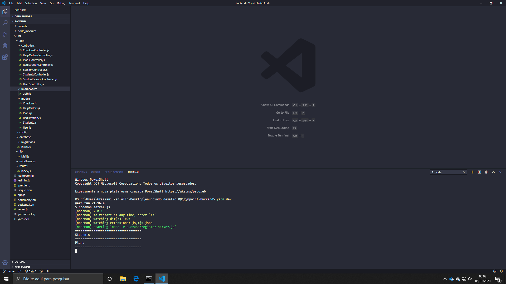

# Backend - GYMPOINT

> Retaguarda do Desafio 9 do Bootcamp da Rocketseat. Interface de comunicação web que frontend e mobile com o banco de dados da aplicação

No desafio proposto para o bootcamp é desenvolver um sistema capaz de administrar uma academia em algumas funções pré-determinada, dentre elas haviam: Usuários do Sistema (User), Sessões (Sessions) Estudantes(Students), Matrículas (Registrations), Planos (Plan), Pedidos de Ajuda (Help Orders) e Entradas (Checkins).

O sistema deve dar o suporte necessário para cadastrar, alterar, consultar e excluir as informações no sistema, além das regras de negócios de conhecimento popular e as de requisito específico.

Bibliotecas utilizadas para o desenvolvimento:

- "bcryptjs": "^2.4.3",
- "cors": "^2.8.5",
- "date-fns": "^2.0.0-beta.5",
- "express": "^4.17.1",
- "jsonwebtoken": "^8.5.1",
- "nodemailer": "^6.4.2",
- "pg": "^7.14.0",
- "pg-hstore": "^2.3.3",
- "sequelize": "^5.21.3",
- "yup": "^0.27.0"



## Instalação

Na raiz do projeto execute o comando abaixo para recuperar (baixar) as biblitecas de execução e desenvolvimento:

```sh
yarn install
```

## Configuração para Desenvolvimento

Após a instalação é necessário editar o arquivo [database.js](./src/config/database.js) e corrigir os dados do banco de dados, como _host_, _username_, _password_, _database_. O sistema foi desenvolvimento utilizando como ferramenta auxiliar o _Docker_, portanto havia um container do Postgre versão 11 e uma database criada e vazia. Os procedimentos servirão para criar o banco de dados e popular com algumas informações básicas.

Com esses requisitos cumpridos o utilizador precisa executar as Migrations (criar os banco de dados) e os Seed.

```sh
yarn sequelize db:migrate
```

```sh
yarn sequelize db:seed
```

## Uso

Basicamente para executar o backend basta executar o comando baixo, lembrando que é para desenvolvimento de não para produção.

```sh
yarn dev
```

## Histórico de lançamentos

- 0.0.1
  - Trabalho em andamento

## Meta

Graziani Zanfolin – [@gzanfolin](https://twitter.com/gzanfolin) – zanfolin@gmail.com

Distribuído sob a licença MIT. Veja `LICENSE` para mais informações.

Template oferecido por:
[https://github.com/yourname/github-link](https://github.com/othonalberto/)
