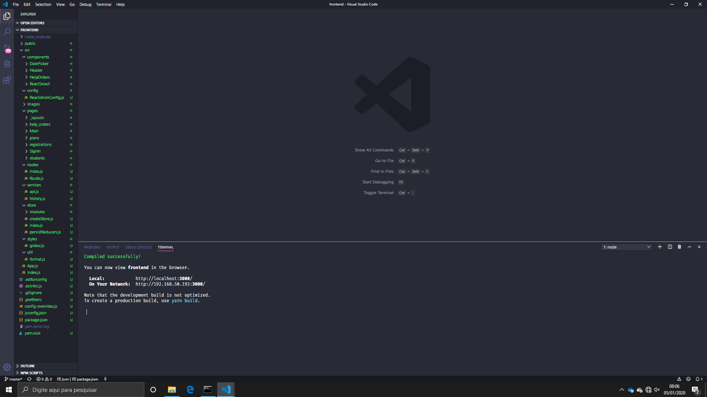
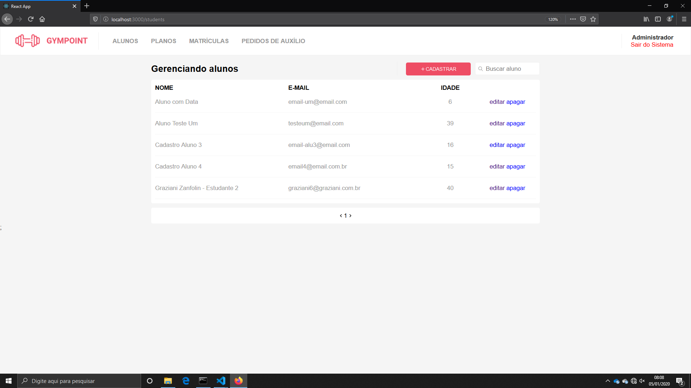
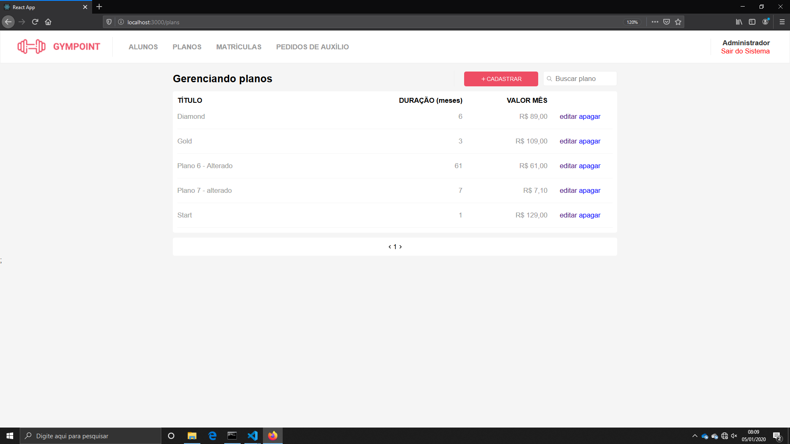
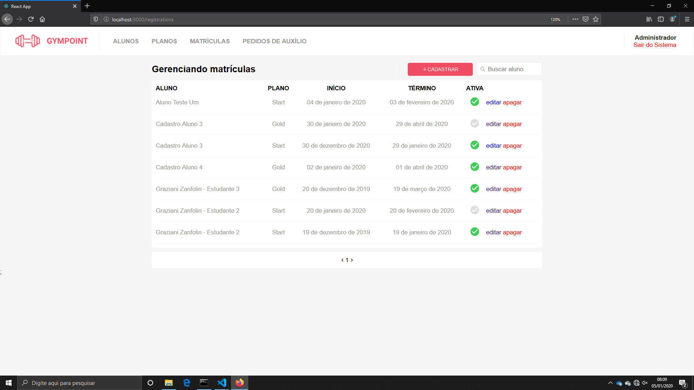
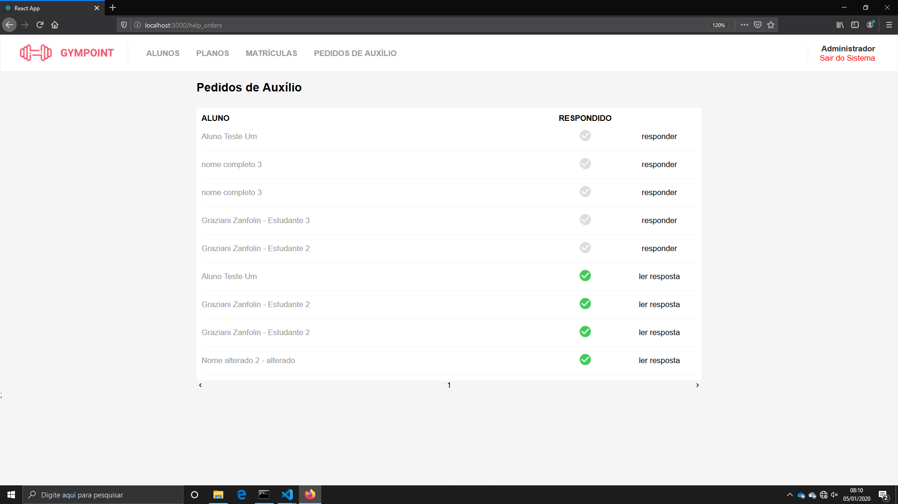

# Frontend - GYMPOINT

> Sistema Web (frontend) do Desafio 9 do Bootcamp da Rocketseat. Interface de comunicação web que o Administrador do sistema utiliza para realizar as operações no sistema.

No desafio proposto para o bootcamp é desenvolver um sistema capaz de administrar uma academia em algumas funções pré-determinada, dentre elas haviam: Usuários do Sistema (User), Sessões (Sessions) Estudantes(Students), Matrículas (Registrations), Planos (Plan), Respostas para os Pedidos de Ajudas (Help Orders).

O sistema deve dar o suporte visual necessário para cadastrar, alterar, consultar e excluir as informações no sistema, respeitar as regras de negócios propostas, usar o backend da aplicação e interagir com o usuário, proporcionando melhor conforto.

Bibliotecas utilizadas para o desenvolvimento:

- "@rocketseat/unform": "^1.6.1",
- "@testing-library/jest-dom": "^4.2.4",
- "@testing-library/react": "^9.3.2",
- "@testing-library/user-event": "^7.1.2",
- "axios": "^0.19.0",
- "date-fns": "^2.8.1",
- "history": "^4.10.1",
- "immer": "^5.0.2",
- "polished": "^3.4.2",
- "prop-types": "^15.7.2",
- "react": "^16.12.0",
- "react-datepicker": "^2.10.1",
- "react-dom": "^16.12.0",
- "react-icons": "^3.8.0",
- "react-modal": "^3.11.1",
- "react-redux": "^7.1.3",
- "react-router-dom": "^5.1.2",
- "react-scripts": "3.3.0",
- "react-select": "^3.0.8",
- "react-toastify": "^5.4.1",
- "reactotron-react-js": "^3.3.7",
- "reactotron-redux": "^3.1.2",
- "reactotron-redux-saga": "^4.2.3",
- "redux": "^4.0.4",
- "redux-persist": "^6.0.0",
- "redux-saga": "^1.1.3",
- "styled-components": "^4.4.1",
- "yup": "^0.28.0"



## Instalação

Na raiz do projeto execute o comando abaixo para recuperar (baixar) as biblitecas de execução e desenvolvimento:

```sh
yarn install
```

## Configuração para Desenvolvimento

O ambiente de desenvolvimento da aplicação foi considerado como _localhost_, ou seja, o banco de dados, backend e frontend estão em execução na mesma máquina. Dessa maneira não se exige nenhuma configuração adicional.

## Uso

Basicamente para executar o frontend basta executar o comando baixo, lembrando que é para desenvolvimento de não para produção.

```sh
yarn start
```

## Exemplo do Uso em Desenvolimento






## Erro Detectado

O componente History não está funcionando, apesar da configuração estar aparentemente correta. Assim, em algumas transições de tela é necessário clicar em _Atualizar a Página_ do navegador para corrigir a rota.

## Histórico de lançamentos

- 0.0.1
  - Trabalho em andamento

## Meta

Graziani Zanfolin – [@gzanfolin](https://twitter.com/gzanfolin) – zanfolin@gmail.com

Distribuído sob a licença MIT. Veja `LICENSE` para mais informações.

Template oferecido por:
[https://github.com/yourname/github-link](https://github.com/othonalberto/)
