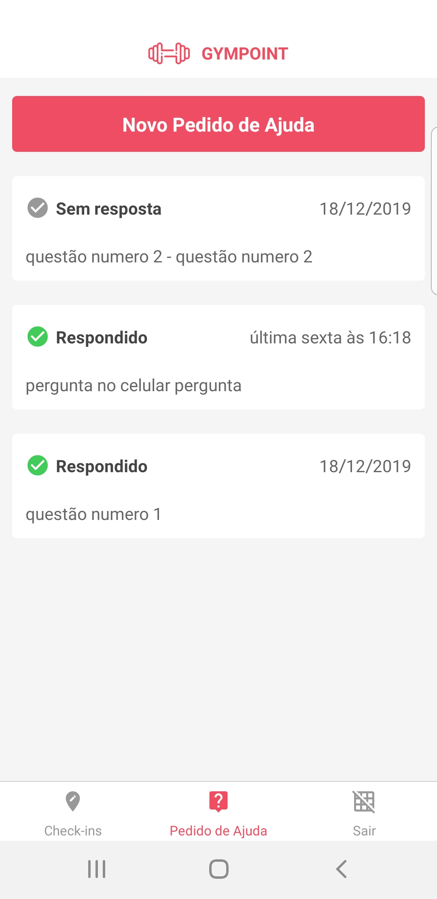

# Mobile - GYMPOINT

> Sistema Mobile do Desafio 9 do Bootcamp da Rocketseat. Interface mobile (mõvel) que o Estudante do sistema utiliza para realizar as operações no sistema.

No desafio proposto para o bootcamp é desenvolver um sistema capaz de administrar uma academia em algumas funções pré-determinada para o aluno da academia, , Sessões (Sessions), Pedidos de Ajuda (Help Orders) e Checkins (acessos a academia).

O sistema deve dar o suporte visual necessário para realizar checkins, realizar os pedidos e ajuda e acompanhar as respostas, respeitar as regras de negócios propostas, usar o backend da aplicação e interagir com o usuário, proporcionando melhor conforto.

Bibliotecas utilizadas para o desenvolvimento:

- "@react-native-community/async-storage": "^1.7.1",
- "@react-native-community/masked-view": "^0.1.5",
- "axios": "^0.19.0",
- "date-fns": "^2.8.1",
- "immer": "^5.1.0",
- "prop-types": "^15.7.2",
- "react": "16.9.0",
- "react-native": "0.61.5",
- "react-native-gesture-handler": "^1.5.3",
- "react-native-linear-gradient": "^2.5.6",
- "react-native-reanimated": "^1.4.0",
- "react-native-screens": "^2.0.0-alpha.22",
- "react-native-vector-icons": "^6.6.0",
- "react-navigation": "^4.0.10",
- "react-navigation-stack": "^2.0.4",
- "react-navigation-tabs": "^2.6.2",
- "react-redux": "^7.1.3",
- "reactotron-react-native": "^4.0.2",
- "reactotron-redux": "^3.1.2",
- "reactotron-redux-saga": "^4.2.3",
- "redux": "^4.0.5",
- "redux-persist": "^6.0.0",
- "redux-saga": "^1.1.3",
- "styled-components": "^4.4.1"


## Instalação

Na raiz do projeto execute o comando abaixo para recuperar (baixar) as biblitecas de execução e desenvolvimento:

```sh
yarn install
```

## Configuração para Desenvolvimento

Para o devido utilização do sistema o usuário precisa corrigir o arquivo que contem o endereço e porta do servidor [backend](./src/config/Server.js), assim como o endereço do Reactroton e foi centralizado no arquivo relacionado anteriormente.

Durante o desenvolvimento, foi utilizado um Smartphone Samsumg S8 Plus, portanto, o PC utlizado para o backend, banco de dados, e o smartphone estavam na mesma rede, interligados pelo Wifi. Para outra configuração, é necessário nova configuração de comunicação.

É necessário atulizar o endereço de IP do servidor (backend) e a porta, e também o endereço do Reactotron.

## Uso

Antes da utlização deve-se verificar se o smartphone é conectado ao sistema, devidamente configurado com o sistema operacional. Configurado os endereços e o aparelho de celular basta executar o comando baixo, lembrando que é para desenvolvimento de não para produção.

```sh
react-native run-android
```

## Exemplo do Uso em Desenvolimento





## Erro Detectado

Todas as vezes que se executava o comando _yarn_ é necessário reconfigurar o arquivo _blacklist.js_ do pacote metro-config no caminho relacionado: 'node_modules\metro-config\src\defaults\blacklist.js' e alterar o seguinte trecho de código para:

```sh
var sharedBlacklist = [
  /node_modules[\/\\]react[\/\\]dist[\/\\].*/,
  /website\/node_modules\/.*/,
  /heapCapture\/bundle\.js/,
  /.*\/__tests__\/.*/
];
```

## Histórico de lançamentos

- 0.0.1
  - Trabalho em andamento

## Meta

Graziani Zanfolin – [@gzanfolin](https://twitter.com/gzanfolin) – zanfolin@gmail.com

Distribuído sob a licença MIT. Veja `LICENSE` para mais informações.

Template oferecido por:
[https://github.com/yourname/github-link](https://github.com/othonalberto/)
