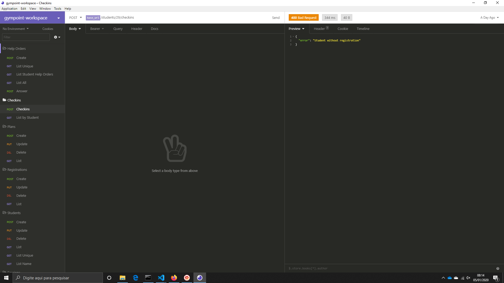
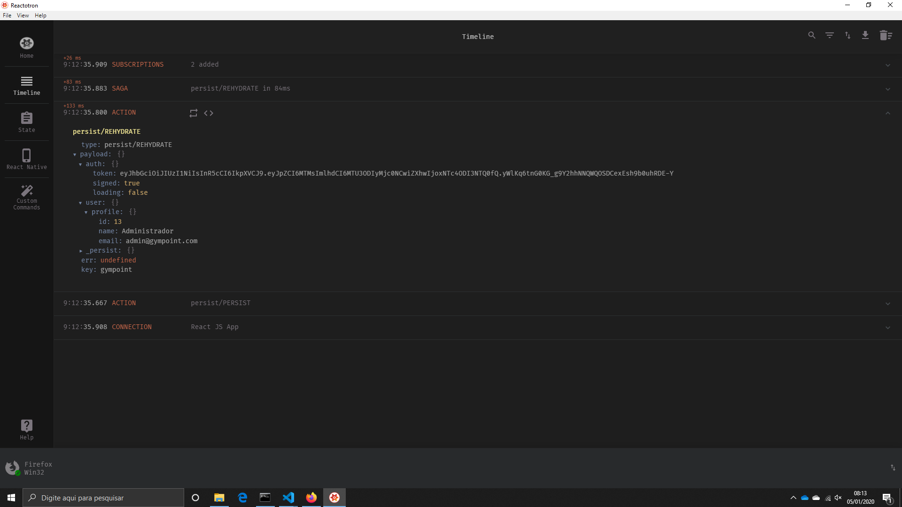
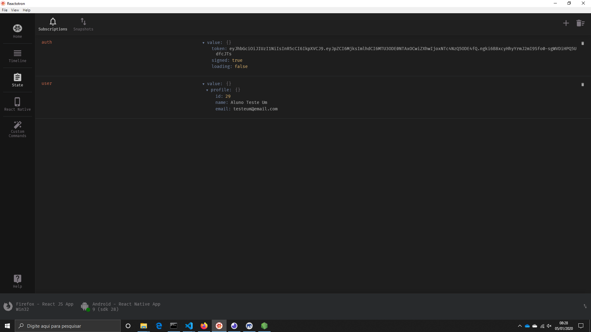

# GYMPOINT

> Sistema do Desafio 9 do Bootcamp da Rocketseat.

O sistema é composto por basicamente quatro partes importantes: banco de dados, backend, frontend e mobile.

## Instalação

Entrar na raiz de cada projeto, e as instruções estáo no Readme de cada componente da aplicação.

[Backend](./backend/readme.md)
[Frontend](./frontend/readme.md)
[Mobile](./mobile/readme.md)

## Configuração para Desenvolvimento

Siga a ordem apresentada no item Instalação e em suas instruções

## Exemplo de Aplicativos utilizados no desenvolvimento

## Histórico de lançamentos

- 0.0.1
  - Trabalho em andamento

## Meta

Graziani Zanfolin – [@gzanfolin](https://twitter.com/gzanfolin) – zanfolin@gmail.com

Distribuído sob a licença MIT. Veja `LICENSE` para mais informações.

Template oferecido por:
[https://github.com/yourname/github-link](https://github.com/othonalberto/)
